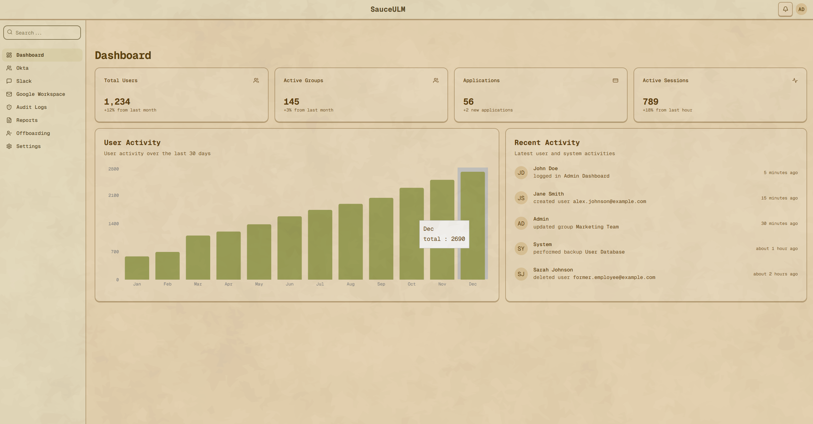
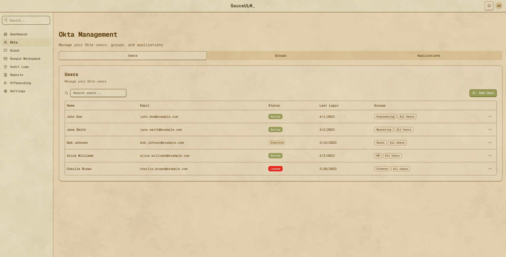
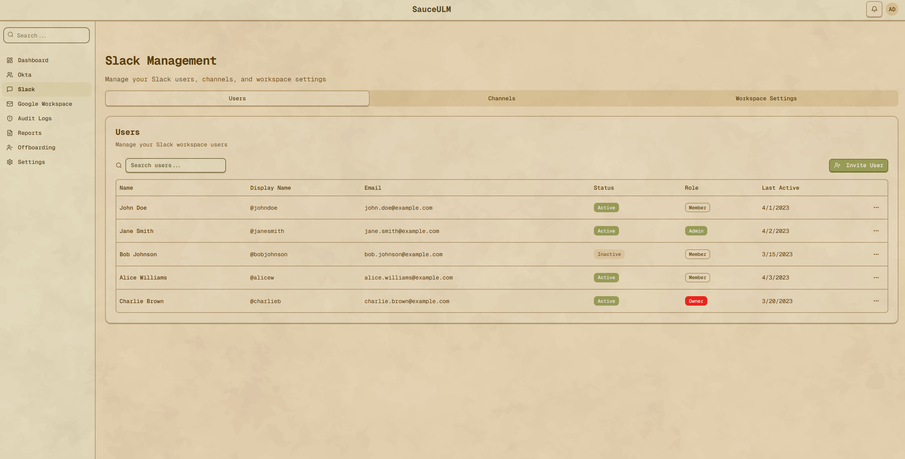
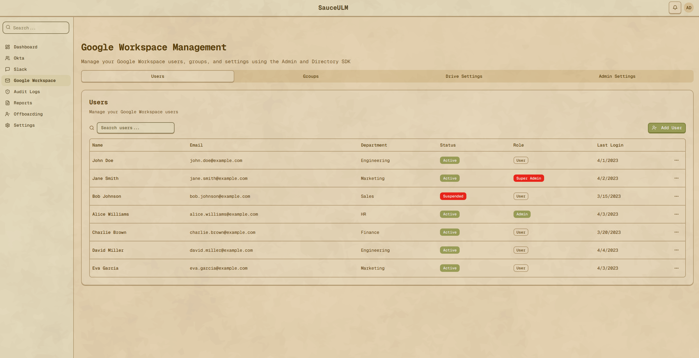
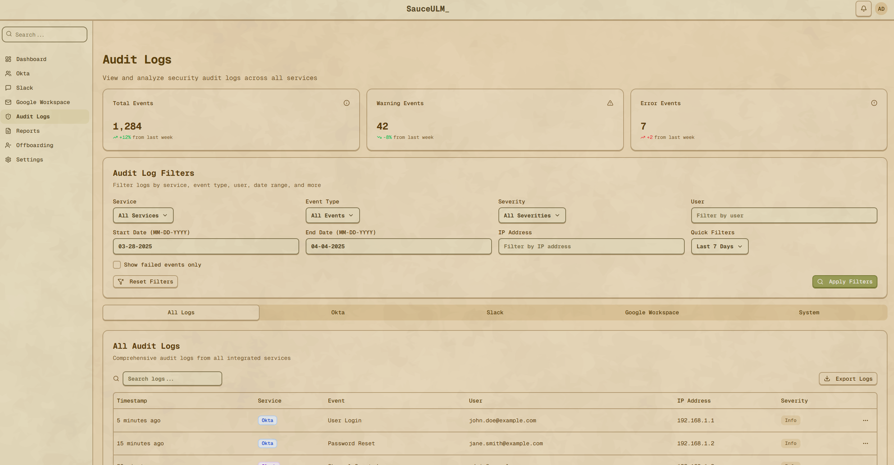

# SauceULM_ Admin Dashboard

<div align="center">
  
  <p><em>SauceULM_ Admin Dashboard with Matsu Theme</em></p>

  <p>
    <a href="https://nextjs.org">
      
    </a>
    <a href="https://ui.shadcn.com">
      
    </a>
    <a href="https://matsu-theme.vercel.app">
      
    </a>
    <a href="https://tailwindcss.com">
      
    </a>
    <a href="https://www.typescriptlang.org">
      
    </a>
  </p>
</div>

> This is a fully Vibe coded project with a combination of tools like Augment and Roocode with Gemini 2.5 based on [Matsu Theme](https://matsu-theme.vercel.app/) shadcn theme.

## 🌟 Overview

SauceULM_ is an elegant admin dashboard built with Next.js and Shadcn UI components, featuring the beautiful Matsu theme. This dashboard provides a comprehensive interface for managing Okta, Slack, and Google Workspace services, along with additional functionality for audit logs, offboarding, and reporting.

## 📺 Demo

<div align="center">
  <table>
    <tr>
      <td align="center">
        
        <br />
        <em>Okta User Management</em>
      </td>
      <td align="center">
        
        <br />
        <em>Slack Workspace Management</em>
      </td>
    </tr>
    <tr>
      <td align="center">
        
        <br />
        <em>Google Workspace Management</em>
      </td>
      <td align="center">
        
        <br />
        <em>Audit Logs & Reporting</em>
      </td>
    </tr>
  </table>
</div>

## ✨ Features

- **Modern UI with Matsu Theme**: Warm, earthy tones inspired by the Ghibli aesthetic
- **Responsive Design**: Works seamlessly on desktop and mobile devices
- **Integrated Services**:
  - Okta user and group management
  - Slack workspace administration
  - Google Workspace user and group controls
- **Additional Tools**:
  - Audit Logs with filtering and visualization
  - Offboarding workflow management
  - Comprehensive reporting system
- **Performance Optimized**: Built with Next.js for optimal loading and rendering

## 🚀 Getting Started

### Prerequisites

- Node.js 18.x or higher
- npm or yarn

### Installation

1. Clone the repository:
   ```bash
   git clone https://github.com/findanish/sauceulm-ghibli.git
   cd sauceulm-ghibli
   ```

2. Install dependencies:
   ```bash
   npm install --legacy-peer-deps
   # or
   yarn install --legacy-peer-deps
   ```

3. Run the development server:
   ```bash
   npm run dev
   # or
   yarn dev
   ```

4. Open [http://localhost:6868](http://localhost:6868) in your browser to see the dashboard.

## 🎨 Theme Customization

The dashboard uses the Matsu theme from Shadcn UI, which provides a warm, earthy color palette inspired by Studio Ghibli aesthetics. The theme can be customized in the following files:

- `tailwind.config.js` - For color definitions and theme variables
- `src/app/globals.css` - For global styles
- `src/app/typography.css` - For typography-specific styles

### Key Design Elements

- **Color Palette**: Warm beiges, soft greens, and earthy browns
- **Typography**: Geist Mono fonts for consistent, readable text
- **Layout**: Fixed sidebar with centered logo in the header
- **Components**: Shadcn UI components styled with the Matsu theme

## 📁 Project Structure

```
src/
├── app/                  # Next.js app router pages
│   ├── dashboard/        # Dashboard pages for each service
│   └── login/            # Authentication pages
├── components/
│   ├── dashboard/        # Dashboard-specific components
│   │   ├── audit-logs/   # Audit logs components
│   │   ├── okta/         # Okta management components
│   │   ├── slack/        # Slack management components
│   │   └── ...           # Other service components
│   └── ui/               # Reusable UI components (Shadcn)
└── lib/                  # Utility functions and helpers
```

## 🔧 Configuration

The dashboard is configured to run on port 6868 by default. You can change this in the `package.json` file:

```json
"scripts": {
  "dev": "next dev --turbopack --port 6868",
  ...
}
```

## 🤝 Contributing

Contributions are welcome! Please feel free to submit a Pull Request.

1. Fork the repository
2. Create your feature branch (`git checkout -b feature/amazing-feature`)
3. Commit your changes (`git commit -m 'Add some amazing feature'`)
4. Push to the branch (`git push origin feature/amazing-feature`)
5. Open a Pull Request

## 📝 License

This project is licensed under the MIT License - see the LICENSE file for details.

## 🙏 Acknowledgements

- [Matsu Theme](https://matsu-theme.vercel.app/) for the beautiful Shadcn UI theme
- [Next.js](https://nextjs.org/) for the React framework
- [Shadcn UI](https://ui.shadcn.com/) for the component library
- [Lucide Icons](https://lucide.dev/) for the icon set
- [Tailwind CSS](https://tailwindcss.com/) for styling

---

Created with ❤️ by [Anish Mehta](https://github.com/findanish)
